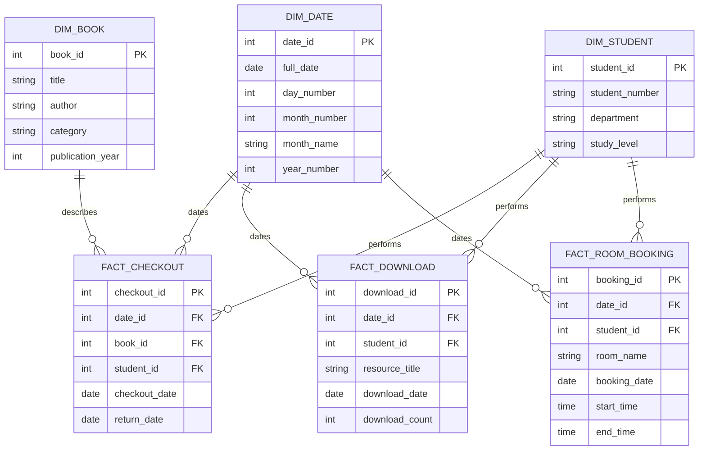

# University Library Dimensional Model

```mermaid
erDiagram
    DIM_DATE ||--o{ FACT_CHECKOUT : dates
    DIM_BOOK ||--o{ FACT_CHECKOUT : describes
    DIM_STUDENT ||--o{ FACT_CHECKOUT : performs

    DIM_DATE ||--o{ FACT_DOWNLOAD : dates
    DIM_STUDENT ||--o{ FACT_DOWNLOAD : performs

    DIM_DATE ||--o{ FACT_ROOM_BOOKING : dates
    DIM_STUDENT ||--o{ FACT_ROOM_BOOKING : performs

    DIM_DATE {
        int date_id PK
        date full_date
        int day_number
        int month_number
        string month_name
        int year_number
    }

    DIM_BOOK {
        int book_id PK
        string title
        string author
        string category
        int publication_year
    }

    DIM_STUDENT {
        int student_id PK
        string student_number
        string department
        string study_level
    }

    FACT_CHECKOUT {
        int checkout_id PK
        int date_id FK
        int book_id FK
        int student_id FK
        date checkout_date
        date return_date
    }

    FACT_DOWNLOAD {
        int download_id PK
        int date_id FK
        int student_id FK
        string resource_title
        date download_date
        int download_count
    }

    FACT_ROOM_BOOKING {
        int booking_id PK
        int date_id FK
        int student_id FK
        string room_name
        date booking_date
        time start_time
        time end_time
    }
```
